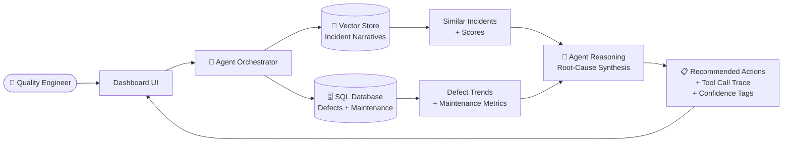

# Next GenAI — Agentic Quality Intelligence Dashboard

> **MVP Research Demo** | Confidence: 0.90
> A single-page dashboard proving end-to-end agentic reasoning over multi-modal enterprise data.

---

## 🧭 What This Dashboard Does

| Layer | Technique | Purpose |
|---|---|---|
| **Narrative** | Vector Search | Similar incident retrieval |
| **Structured** | SQL Analytics | Defect + maintenance trends |
| **Combined** | Agent Reasoning | Root-cause themes + recommended actions |

---

## 🖥️ Core Screens (Tabs)

### Tab 1 — Ask the Agent

**Input:** Text box — *"Describe the issue…"*

**Output sections:**
- 🔍 **Top Similar Incidents** — ranked by vector similarity score
- 🧠 **Reasoned Summary** — agent synthesis of retrieved incidents
- ✅ **Recommended Actions** — with confidence tags (e.g., `HIGH`, `MEDIUM`)
- 🔧 **Show Tool Calls** — transparency panel showing which tools were invoked

**Test Queries:**

| Query | Expected Similar Incidents |
|---|---|
| *"Hydraulic leak near actuator; suspected seal degradation; reworked and tested."* | leak / seal / actuator / pump / line |
| *"Intermittent short circuit in avionics harness; chafing observed; replaced wiring."* | harness / chafing / connector / intermittent faults |
| *"Corrosion on fastener around skin panel; treated and replaced; lot quarantined."* | corrosion / fastener / structures / supplier variance |

> ⚠️ *Similarity quality depends heavily on chunking + embedding model choice.*

---

### Tab 2 — Incident Similarity Explorer

- **Search bar** + **filters**: system, severity, date range
- **Results list** with similarity scores
- **Click-through** on any incident → shows:
  - Full narrative text
  - Corrective action taken
  - Metadata (date, system, severity)
  - Related defects & maintenance logs

---

### Tab 3 — Defect Analytics

#### KPI Cards
- Total defect rate
- Critical defect count
- Top defect types

#### Charts

**1. Defects by Type** *(Bar Chart)*
- X-axis: `defect_type`
- Y-axis: count
- Show top 10 types

**2. Severity Distribution** *(Stacked Bar)*
- X-axis: system or plant
- Y-axis: count
- Stack: `Low` / `Med` / `High` / `Critical`

**3. Defect Trend by Week** *(Line Chart)*
- X-axis: week
- Y-axis: defect count
- Filters: product, plant, defect_type

**4. Incident Themes from Retrieved Results** *(Horizontal Bar)*
- Source: top retrieved incident narratives
- Method: TF-IDF keyword extraction or LLM summarization
- Example themes: `"seal"`, `"leak"`, `"torque"`, `"chafing"`

> ⚠️ *For MVP: basic aggregation + 1 theme chart is sufficient. Avoid complex ML on charts.*

---

### Tab 4 — Maintenance Trends

- **Asset selector** dropdown
- **Charts:**

**5. Metrics Over Time** *(Line Chart)*
- X-axis: timestamp
- Y-axis: metric_value

**Before/After Corrective Action** *(Annotated Line)*
- Same axes as above
- Vertical marker at corrective action date with label

---

### Tab 5 — Data & Evaluation

#### Dataset Health
| Metric | Value |
|---|---|
| Total incident records | — |
| Total defect records | — |
| Missing values | — |
| Latest ingest time | — |

#### Offline Evaluation
| Metric | Target |
|---|---|
| Precision@k (similarity) | — |
| Query latency | — |
| Cost per query estimate | — |

---

## 🏗️ Architecture (How It Works)

---

## 🔬 Why This Is a Strong Research MVP

### What Makes It "Researchy"

Evaluating agentic reasoning over **multi-modal enterprise data**:
- 📄 Unstructured text → incident narratives
- 📊 Structured metadata → defect records
- 📈 Time series → maintenance metrics

### Measurable Outcomes
- Retrieval quality: **precision@k**
- Speed: **time-to-insight**
- Reliability: **action recommendation consistency**

> ⚠️ *Don't claim "true root cause" accuracy from synthetic/Kaggle data — frame results as "evidence-backed hypotheses."*

---

## 🩹 Pain Points This Solves

| Problem | How the Dashboard Addresses It |
|---|---|
| Narrative search is slow and keyword-dependent | Vector search finds **semantic matches** regardless of phrasing |
| Analytics and narratives live in separate systems | Agent **bridges both** in a single query |
| Recommendations are not traceable | Tool-call transparency + citations = **auditable reasoning** |
| Hard to prioritize what to fix | Unified view of **impact + recurrence + severity** |

> ✅ *This MVP solves "workflow + insight latency" more than "perfect prediction."*

---

## 📐 Scope Guidance

> Keep scope tight: **1–2 pages can still prove the agentic workflow** if you show tool calls + combined insights.

**Minimum viable demo:**
- [ ] `Ask the Agent` tab with vector search + synthesis
- [ ] At least 1 defect chart (bar or trend)
- [ ] Tool call transparency panel
- [ ] Architecture diagram ("How it works" panel)

**Nice to have:**
- [ ] Incident Similarity Explorer with click-through
- [ ] Maintenance before/after comparison
- [ ] Offline eval metrics tab